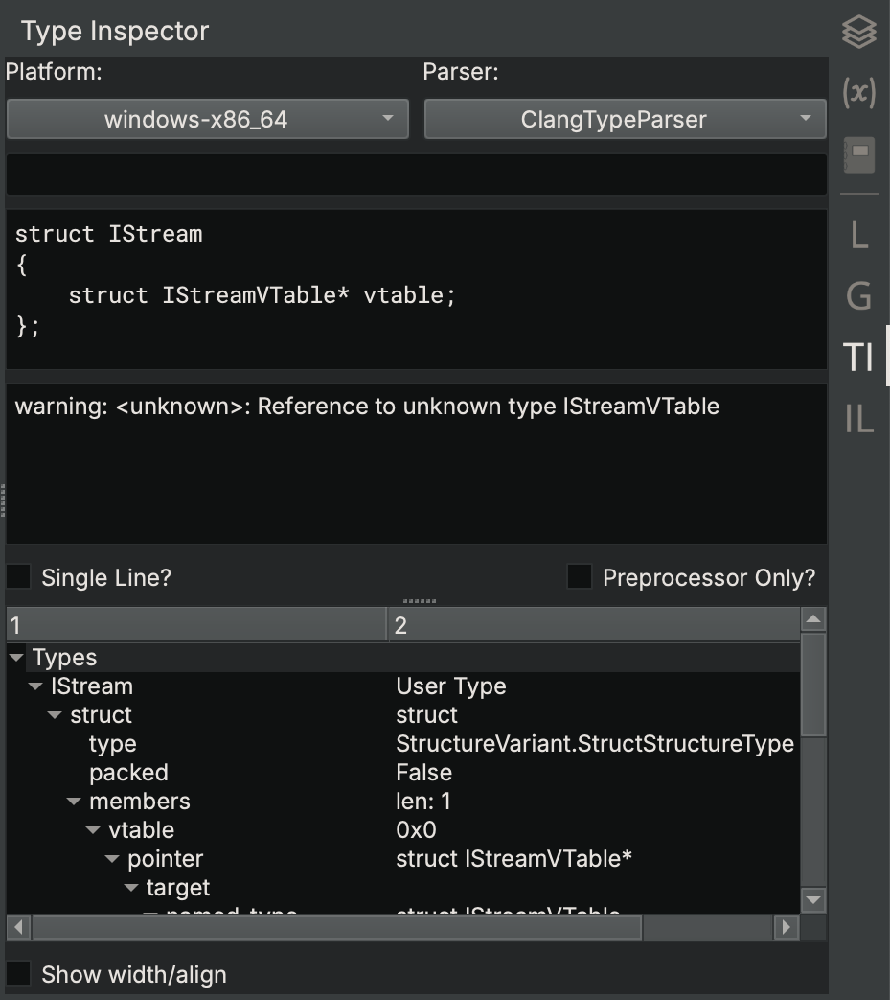

Binary Ninja Inspectors
--

This is a big collection of inspectors and sidebars for Binary Ninja that I have made and regularly use.
They are not really polished or guaranteed to work for people other than myself, but you may get good use out of them.
Note that many of them (looking at you, Linear Inspector) have abyssmal performance and turn your sidebar game into a bit of a minefield ;)

## Analysis Progress
See where your analysis is running (or stalled, as often seems to be the use case)

## Type Inspector
Debug the Type Parser api and find out why your types do/don't parse

## Graph Inspector
See what the tokens in the flow graph actually are

## Linear Inspector
Shows you the contents of the tree structure of Linear View

## IL Inspector
See all the details of all the IL expressions and instructions in a function.

## Register Inspector
See the values of all registers used in the function, and if they changed at the current address.

## License

MIT License, Copyright Vector 35 since I wrote these on work time
